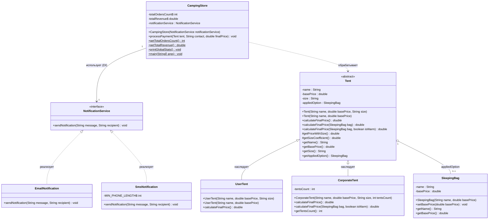

# UML-диаграмма классов (часть 2)

```mermaid
classDiagram
class NotificationService {
    <<interface>>
    +sendNotification(String message, String recipient) void
}
class EmailNotification {
    +sendNotification(String message, String recipient) void
}
class SmsNotification {
    -MIN_PHONE_LENGTH$ int
    +sendNotification(String message, String recipient) void
}
class SleepingBag {
    -name : String
    -basePrice : double
    +SleepingBag(String name, double basePrice)
    +setBasePrice(double basePrice) void
    +getName() String
    +getBasePrice() double
}
class Tent {
    <<abstract>>
    -name : String
    -basePrice : double
    -size : String
    -appliedOption : SleepingBag
    +Tent(String name, double basePrice, String size)
    +Tent(String name, double basePrice)
    +calculateFinalPrice()* double
    +calculateFinalPrice(SleepingBag bag) double
    +calculateFinalPrice(SleepingBag bag, boolean isWarm) double
    #getPriceWithSize() double
    #getSizeCoefficient() double
    +getName() String
    +getBasePrice() double
    +getSize() String
    +getAppliedOption() SleepingBag
}
class UserTent {
    +UserTent(String name, double basePrice, String size)
    +UserTent(String name, double basePrice)
    +calculateFinalPrice() double
}
class CorporateTent {
    -tentsCount : int
    +CorporateTent(String name, double basePrice, String size, int tentsCount)
    +calculateFinalPrice() double
    +calculateFinalPrice(SleepingBag bag, boolean isWarm) double
    +getTentsCount() int
}
class CampingStore {
    -totalOrdersCount$ int
    -totalRevenue$ double
    -notificationService : NotificationService
    +CampingStore(NotificationService notificationService)
    +processPayment(Tent tent, String contact, double finalPrice) void
    +getTotalOrdersCount()$ int
    +getTotalRevenue()$ double
    +printGlobalStats()$ void
    +main(String[] args)$ void
}

NotificationService <|.. EmailNotification : реализует
NotificationService <|.. SmsNotification : реализует
Tent <|-- UserTent : наследует
Tent <|-- CorporateTent : наследует
Tent "1" o-- "0..1" SleepingBag : appliedOption
CampingStore "1" --> "1" NotificationService : использует (DI)
CampingStore ..> Tent : обрабатывает
```
